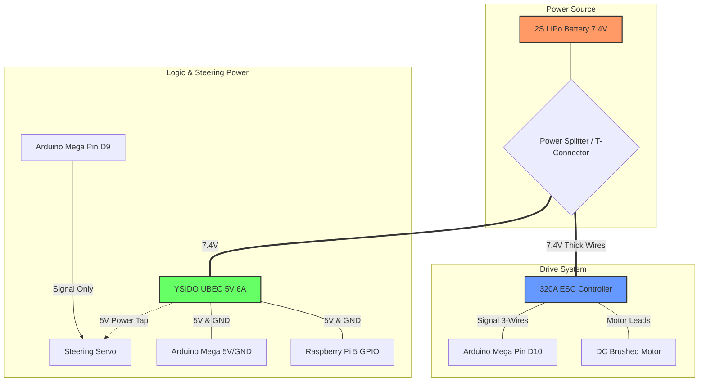
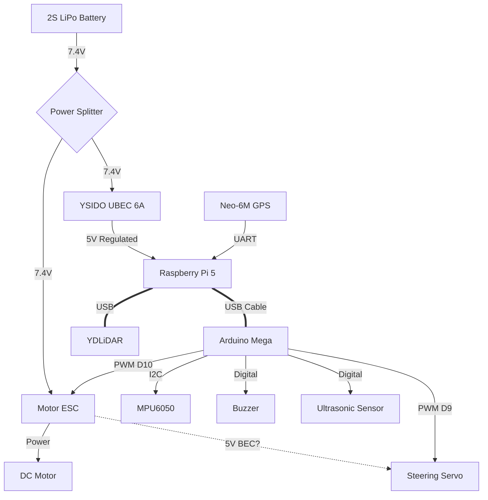

# Hardware Connection Guide

## Power Distribution System
**Critical**: Proper power distribution is essential to prevent "brownouts" (restarts) of the Raspberry Pi or Arduino when the motors kick in.

### 1. Battery (2S Li-Po 7.4V)
- **Connector**: XT60 or T-Plug (Deans).
- **Splitter**: You need to split the battery voltage to two paths:
    1.  **To ESC** (Electronic Speed Controller) -> Powers the DC Motor.
    2.  **To UBEC** (Voltage Regulator) -> Powers the Raspberry Pi 5.

### 2. Servo & Motor Power
- **DC Motor**: Connect to the output leads of the **320A ESC**.
- **Servo (20kg)**:
    -   **Signal (Orange/White)**: To Arduino **Pin 9**.
    -   **Power (+/-)**: **DO NOT** connect to Arduino 5V. The Servo draws too much current.
    -   *Option A*: If your ESC has a built-in BEC (3 wires to receiver), use that 5V/GND.
    -   *Option B (Recommended)*: Share the **YSIDO UBEC** 5V output, but be careful not to starve the Pi.

### 3. Logic Power
- **Raspberry Pi 5**: Power via **YSIDO UBEC (5V 6A)**. Connect UBEC Output to Pi GPIO **Pin 2 (5V)** and **Pin 6 (GND)**.
- **Arduino Mega**: Connect via **USB Cable** to Raspberry Pi 5. This handles both Power and Data.

---

## Signal Connections (Pinout)

### A. Arduino Mega Connections
| Component | Pin Name | Arduino Pin | Notes |
| :--- | :--- | :--- | :--- |
| **Steering Servo** | Signal (PWM) | **D9** |  |
| **ESC (Throttle)** | Signal (PWM) | **D10** |  |
| **IMU (MPU6050)** | SDA | **D20** (SDA) |  |
| | SCL | **D21** (SCL) |  |
| | VCC | 5V |  |
| | GND | GND |  |
| **Buzzer** | Signal (+) | **D11** | Connect (-) to GND |
| **Ultrasonic** | Trig | **D12** | Front Facing |
| | Echo | **D13** |  |

### B. Raspberry Pi 5 Connections
| Component | Connection Type | Port/Pin | Notes |
| :--- | :--- | :--- | :--- |
| **YDLiDAR T-mini** | USB | **USB 3.0 (Blue)** | High bandwidth required |
| **Arduino Mega** | USB | **USB 2.0/3.0** | Serial Communication |
| **GPS (Neo-6M)** | UART TX | **GPIO 15 (RXD)** | GPS TX -> Pi RX |
| | UART RX | **GPIO 14 (TXD)** | GPS RX -> Pi TX |
| | VCC | 3.3V (Pin 1) | **Start with 3.3V**. If no fix, check 5V tollerance |
| | GND | GND (Pin 9) | |

> [!WARNING]
> **GPS Voltage Level**: The Neo-6M module VCC is often 5V, but the TX/RX logic might be 3.3V compatible. Raspberry Pi GPIO is **Strictly 3.3V**. sending 5V to a Pi GPIO will destroy it. Verify your GPS module's logic level. If it's 5V logic, use a **Logic Level Converter** or connect the GPS to the Arduino instead (Arduino Mega is 5V tolerant) and pass data to Pi, or use a USB GPS dongle. For this guide, we will assume a safe 3.3V connection or USB-TTL adapter for the Pi.

---

## Detailed Power & Actuator Subsystem

For troubleshooting motor and steering issues, refer to this detailed power distribution:

### Critical Actuator Checks:
1.  **ESC Switch**: Ensure the physical slide switch on the ESC is **ON**.
2.  **ESC Arming**: You must hear beeps from the ESC when power is applied.
3.  **Servo Power**: The servo red/black wires should go to the 5V UBEC output, not the Arduino's 5V pin.
4.  **Signal Ground**: Ensure the ESC/Servo share a common ground with the Arduino.

---

## Diagram Overview

